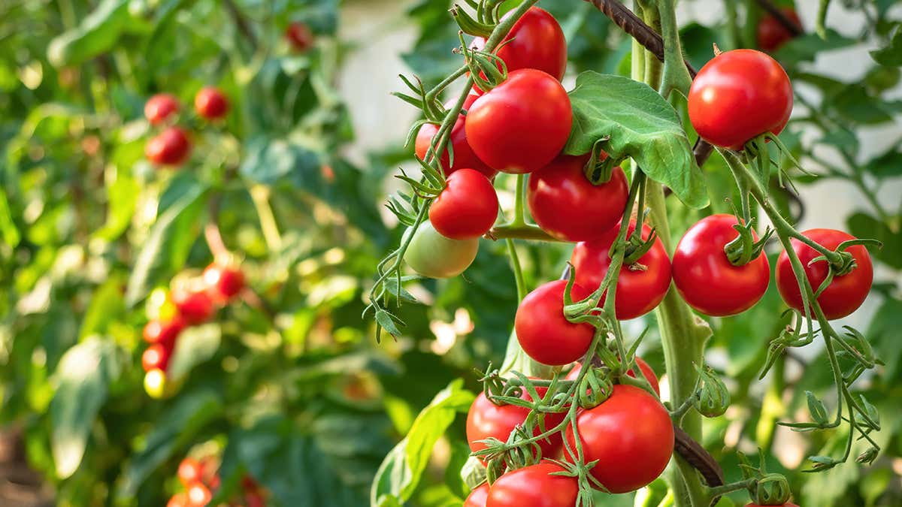
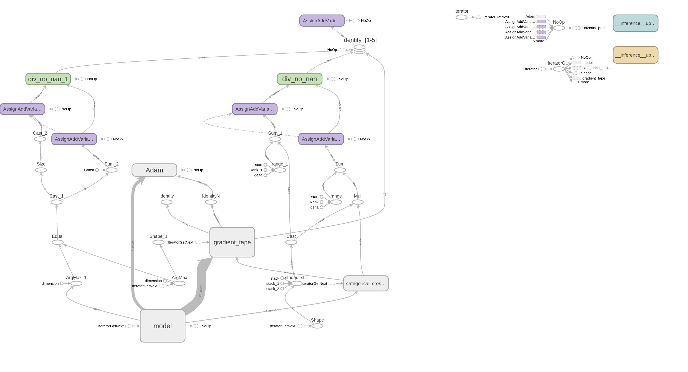

## Project Description:
*It's a web application built on the Flask framework, incorporating a model trained using transfer learning with VGG16.*
*Developed a model to classify diseases affecting Tomato plants based on images of their leaves.*
*Utilized deep learning techniques to analyze leaf images and identify specific disease types.*
*Implemented using TensorFlow, the model achieved accurate disease classification for effective plant health monitoring.* 

## Description:
* Implemented a Tensorflow model using Transfer Learning.
* The model was trained on the Google Colab for 9 epochs
* Employed the VGG19 model for transfer learning.
* Achieved an impressive validation accuracy of 86%.
* Demonstrated a validation loss of less than 0.4315, highlighting strong performance in model validation.

## The VGG model with transfer learing diagram from tensorboard :

## Try out the web app: 
  http://http://188.166.153.41/

## Source:
* The dataset is hosted on Kaggle.
* Dataset Link: [Tomato Dataset on Kaggle](https://www.kaggle.com/noulam/tomato)
* The dataset comprises 10 categories, including 9 types of tomato diseases and one category for healthy tomatoes.

